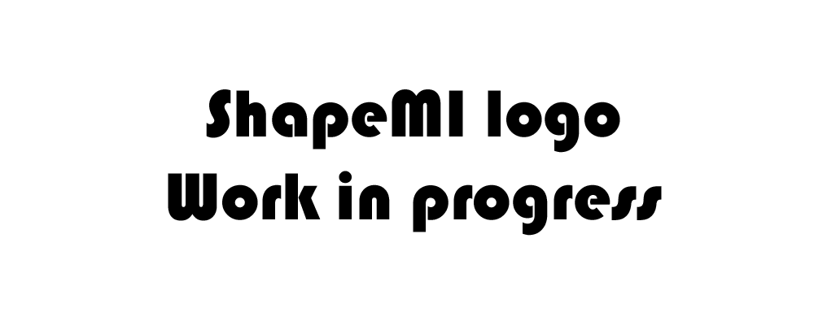

ShapeMI 
---------------------
We gladly announce the workshop on **Shape** in **M**edical **I**maging (SHAPEMI), which is held in conjunction with the conference on Medical Image Computing and Computer Assisted Interventions ([MICCAI 2018](http://www.miccai2018.org/en/)) in Granada, Spain. This workshop arises from the previous MICCAI [SeSAMI](https://sites.google.com/site/sesami2016/) and [SAMI](https://sites.google.com/site/miccaisami2015/) Workshops as well as the [Shape Symposium](http://www.shapesymposium.org) 2015 and 2014). It will provide a presentation venue for researchers working in shape/geometric modeling, learning, analysis, statistics, classification and applications. 

Today’s image data often represents continuous and time-varying phenomena, usually with a geometric structure. Shape and geometry processing methods are receiving increased attention, for example, due to their higher sensitivity to local variations relative to traditional markers, such as the volume of a structure. Shape and spectral analysis and modeling algorithms, as well as application-driven research, are essential to the essence of this workshop. Shape analysis methods are broadly applicable to many different fields from medical image computing to paleontology, anthropology and beyond.

This workshop targets theoretical contributions as well as exciting applications in medical imaging, including (but not limited to):

## Organizers
- Martin Reuter, German Center for Neurodegenerative Diseases, Bonn, Germany &  Harvard Medical School, Boston, USA
- Christian Wachinger, Ludwig-Maximilian-University, Munich, Germany
- Hervé Lombaert, ETS Montreal, Canada & Inria Sophia-Antipolis, France
- Beatriz Paniagua, Kitware Inc. and University of North Carolina at Chapel Hill, USA
- Marcel Lüthi, University of Basel, Switzerland
- Bernhard Egger, Massachusetts Institute of Technology, USA

## Paper and Demo Submission
We will accept the submission of abstracts (1-2 pages) and full papers (8 pages, single column, LNCS style, Latex package here). Both, accepted abstracts and full papers have the option to apply for presenting an on site software demo. The review is single-blind, submissions should include authors and affiliations. Reviewers will be chosen among experts in the medical image computing community. The most original contributions will be selected for oral or poster presentations. We plan on publishing the workshop proceedings in Lecture Notes in Computer Science (LNCS). We may not be able to include abstracts in the proceedings.

Please note that at least one co-author must register to the workshop.

